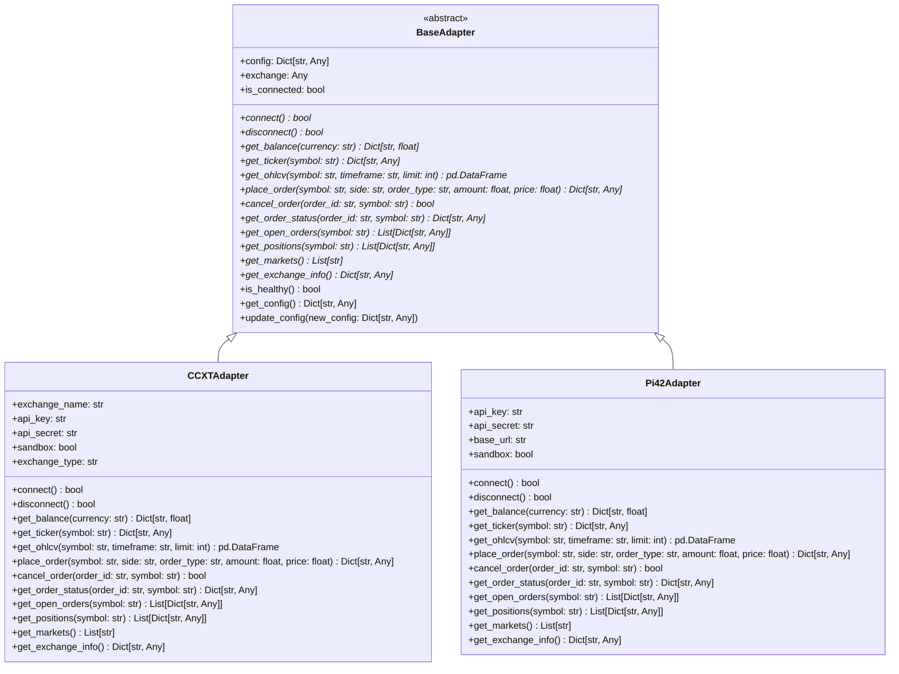
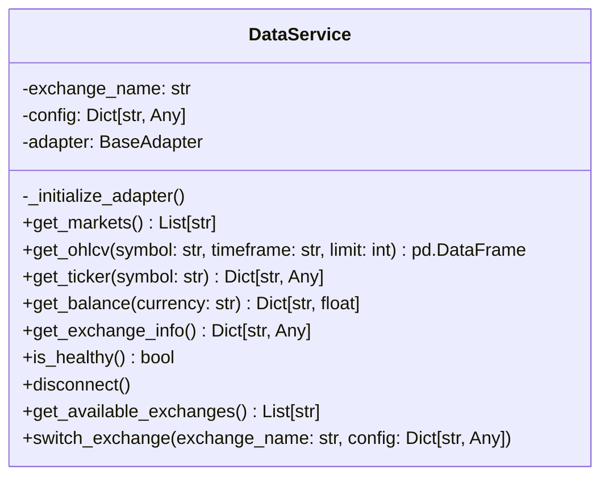
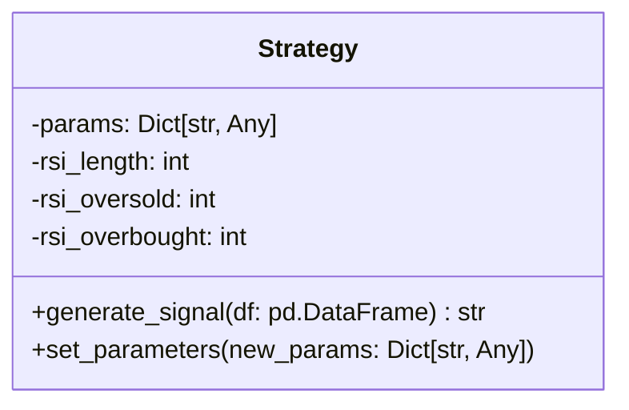
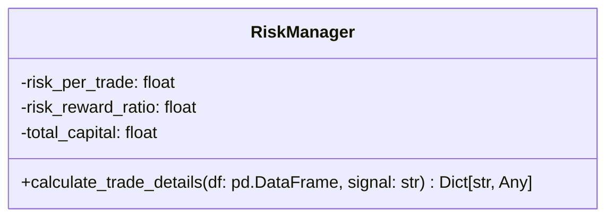
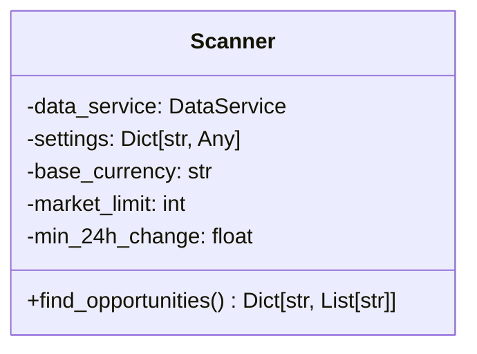
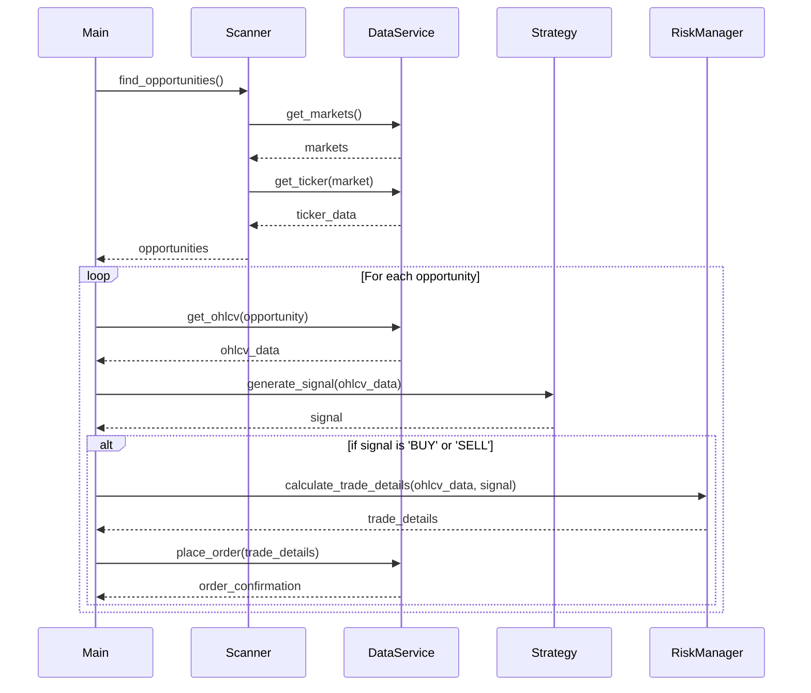

# Low-Level Design (LLD) - Augustan Trading Bot

## 1. Introduction

This document provides a Low-Level Design (LLD) for the Augustan Trading Bot. The LLD describes the detailed design of each module in the system, including class structures, method signatures, data models, and their interactions. This document is intended for developers who will be implementing and maintaining the system.

## 2. Class Diagrams

### 2.1. Adapters Module

### 2.2. Data Service Module

### 2.3. Strategy Module

### 2.4. Risk Manager Module

### 2.5. Scanner Module

## 3. Module-wise LLD

### 3.1. Adapters Module

*   **`BaseAdapter` (Abstract Base Class)**
    *   **Description:** Defines the interface for all exchange adapters.
    *   **Attributes:**
        *   `config: Dict[str, Any]`: Configuration for the adapter.
        *   `exchange: Any`: The exchange instance (e.g., from the `ccxt` library).
        *   `is_connected: bool`: The connection status.
    *   **Methods:**
        *   `connect()`: Establishes a connection to the exchange.
        *   `disconnect()`: Closes the connection to the exchange.
        *   `get_balance(currency: str)`: Fetches the account balance.
        *   `get_ticker(symbol: str)`: Fetches the ticker for a symbol.
        *   `get_ohlcv(symbol: str, timeframe: str, limit: int)`: Fetches OHLCV data.
        *   `place_order(...)`: Places an order.
        *   `cancel_order(order_id: str, symbol: str)`: Cancels an order.
        *   `get_order_status(order_id: str, symbol: str)`: Fetches the status of an order.
        *   `get_open_orders(symbol: str)`: Fetches open orders.
        *   `get_positions(symbol: str)`: Fetches current positions.
        *   `get_markets()`: Fetches available markets.
        *   `get_exchange_info()`: Fetches exchange information.
        *   `is_healthy()`: Checks if the connection is healthy.
        *   `get_config()`: Returns the current configuration.
        *   `update_config(new_config: Dict[str, Any])`: Updates the configuration.

*   **`CCXTAdapter`**
    *   **Description:** Implements the `BaseAdapter` for `ccxt`-supported exchanges.
    *   **Inherits from:** `BaseAdapter`
    *   **Attributes:**
        *   `exchange_name: str`: The name of the exchange (e.g., 'binance').
        *   `api_key: str`: The API key.
        *   `api_secret: str`: The API secret.
        *   `sandbox: bool`: Whether to use the sandbox environment.
        *   `exchange_type: str`: The type of exchange (e.g., 'spot', 'future').
    *   **Methods:** Implements all abstract methods from `BaseAdapter`.

*   **`Pi42Adapter`**
    *   **Description:** Implements the `BaseAdapter` for the Pi42 exchange.
    *   **Inherits from:** `BaseAdapter`
    *   **Attributes:**
        *   `api_key: str`: The API key.
        *   `api_secret: str`: The API secret.
        *   `base_url: str`: The base URL for the Pi42 API.
        *   `sandbox: bool`: Whether to use the sandbox environment.
    *   **Methods:** Implements all abstract methods from `BaseAdapter`.

### 3.2. Data Service Module

*   **`DataService`**
    *   **Description:** Provides a unified interface for fetching data from different exchanges.
    *   **Attributes:**
        *   `exchange_name: str`: The name of the current exchange adapter.
        *   `config: Dict[str, Any]`: The configuration for the adapter.
        *   `adapter: BaseAdapter`: The current adapter instance.
    *   **Methods:**
        *   `_initialize_adapter()`: Initializes the adapter.
        *   `get_markets()`: Fetches the list of available markets.
        *   `get_ohlcv(...)`: Fetches OHLCV data.
        *   `get_ticker(...)`: Fetches ticker data.
        *   `get_balance(...)`: Fetches the account balance.
        *   `get_exchange_info()`: Fetches exchange information.
        *   `is_healthy()`: Checks the health of the service.
        *   `disconnect()`: Disconnects from the exchange.
        *   `get_available_exchanges()`: Returns a list of available adapters.
        *   `switch_exchange(...)`: Switches to a different exchange adapter.

### 3.3. Strategy Module

*   **`Strategy`**
    *   **Description:** Contains the core trading logic.
    *   **Attributes:**
        *   `params: Dict[str, Any]`: The parameters for the strategy.
        *   `rsi_length: int`: The length for the RSI indicator.
        *   `rsi_oversold: int`: The oversold threshold for the RSI.
        *   `rsi_overbought: int`: The overbought threshold for the RSI.
    *   **Methods:**
        *   `generate_signal(df: pd.DataFrame)`: Generates a trading signal ('BUY', 'SELL', or 'HOLD').
        *   `set_parameters(new_params: Dict[str, Any])`: Updates the strategy parameters.

### 3.4. Risk Manager Module

*   **`RiskManager`**
    *   **Description:** Manages risk and position sizing.
    *   **Attributes:**
        *   `risk_per_trade: float`: The percentage of capital to risk per trade.
        *   `risk_reward_ratio: float`: The desired risk-reward ratio.
        *   `total_capital: float`: The total trading capital.
    *   **Methods:**
        *   `calculate_trade_details(df: pd.DataFrame, signal: str)`: Calculates the position size, stop-loss, and take-profit.

### 3.5. Scanner Module

*   **`Scanner`**
    *   **Description:** Scans for trading opportunities.
    *   **Attributes:**
        *   `data_service: DataService`: The data service instance.
        *   `settings: Dict[str, Any]`: The scanner settings.
        *   `base_currency: str`: The base currency to scan against.
        *   `market_limit: int`: The maximum number of markets to scan.
        *   `min_24h_change: float`: The minimum 24-hour change to consider.
    *   **Methods:**
        *   `find_opportunities()`: Finds and returns a watchlist of opportunities.

### 3.6. Configuration Module

*   **Description:** Loads and manages the application's configuration.
*   **Files:**
    *   `config.py`: Loads configuration from `constants.py` and environment variables.
    *   `constants.py`: Defines constants and loads `active_config.json`.
    *   `active_config.json`: The main configuration file.
*   **Key Variables:**
    *   `ACTIVE_CONFIG`: A dictionary containing the consolidated configuration.

### 3.7. Main Module

*   **`main.py`**
    *   **Description:** The main entry point of the application.
    *   **Logic:**
        1.  Load the configuration.
        2.  Initialize the `DataService`.
        3.  Initialize the `Scanner`.
        4.  Initialize the `Strategy`.
        5.  Initialize the `RiskManager`.
        6.  Start the main application loop:
            *   Use the `Scanner` to find opportunities.
            *   For each opportunity:
                *   Fetch data using the `DataService`.
                *   Generate a signal using the `Strategy`.
                *   If there is a 'BUY' or 'SELL' signal:
                    *   Calculate trade details using the `RiskManager`.
                    *   Place an order using the `DataService`.

## 4. Data Models

*   **OHLCV Data:** `pandas.DataFrame` with columns: `timestamp`, `open`, `high`, `low`, `close`, `volume`.
*   **Ticker Data:** `Dict[str, Any]` with keys: `symbol`, `last`, `bid`, `ask`, `volume`, etc.
*   **Balance Data:** `Dict[str, float]` with currency as key and balance as value.
*   **Order Data:** `Dict[str, Any]` with keys: `id`, `symbol`, `side`, `type`, `amount`, `price`, `status`, etc.
*   **Position Data:** `Dict[str, Any]` with keys: `symbol`, `side`, `size`, `entry_price`, etc.
*   **Trade Details:** `Dict[str, Any]` with keys: `position_size`, `stop_loss`, `take_profit`, `entry_price`.

## 5. Sequence Diagram

This diagram illustrates a typical trading workflow.

